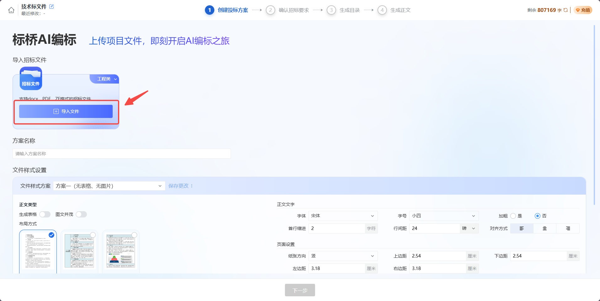
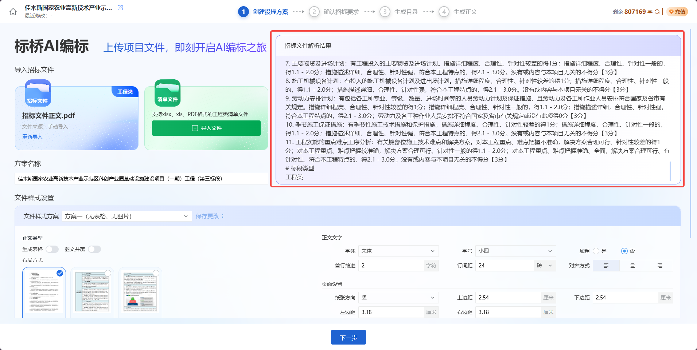
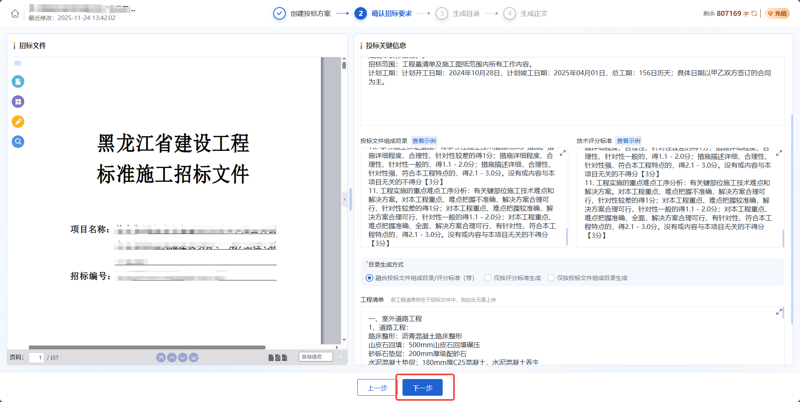
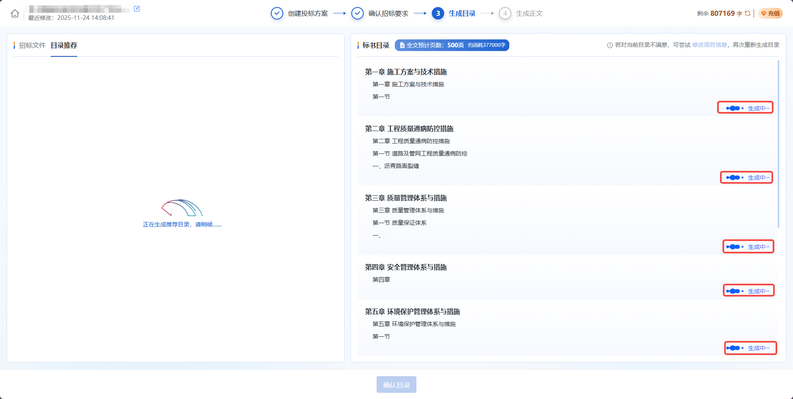
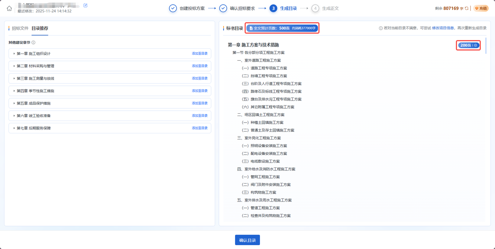
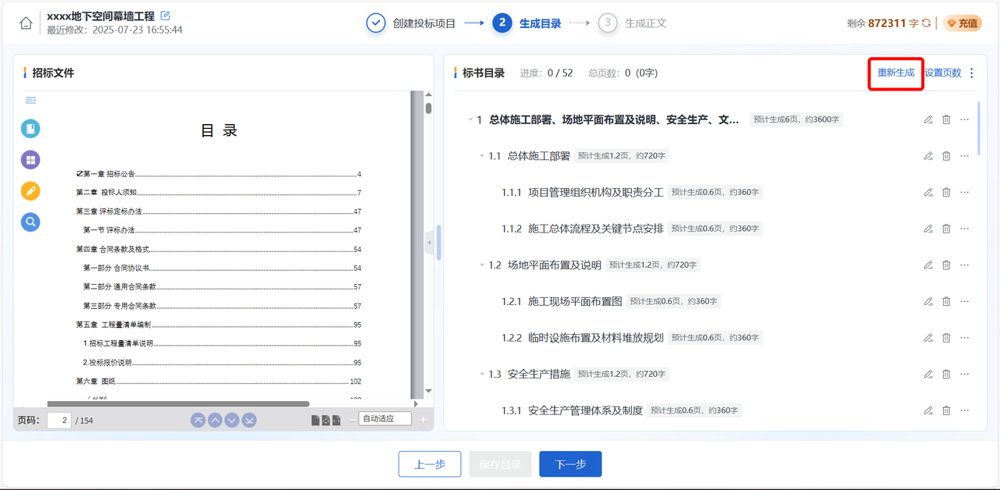
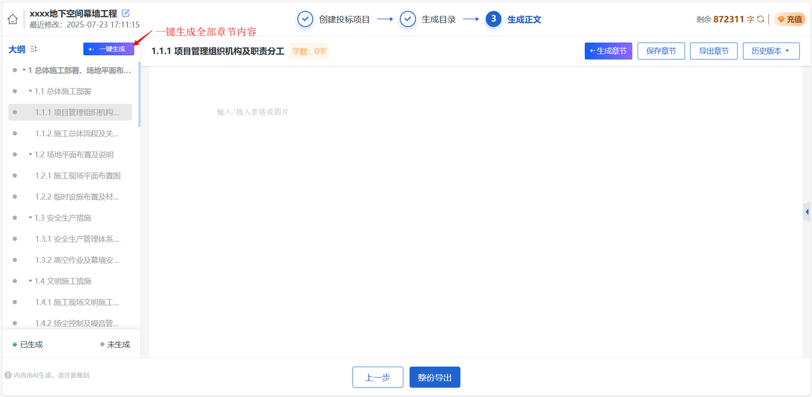
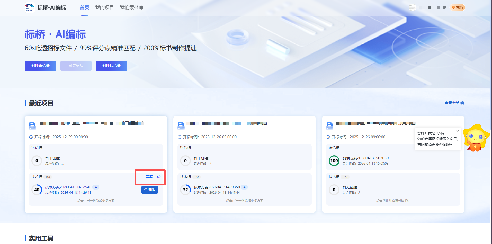
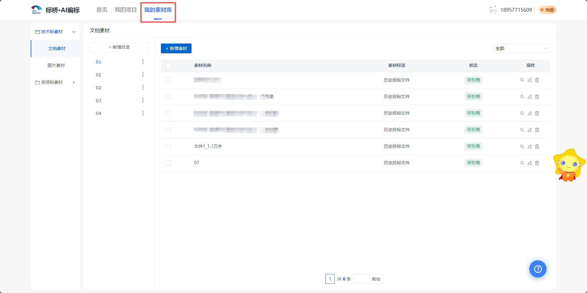
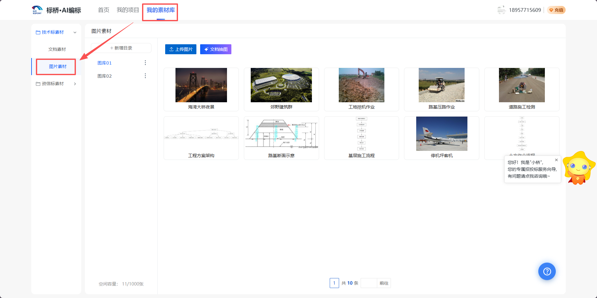

# AI编标
## 产品简介
标桥·AI编标是一款基于人工智能技术的智能投标文件编写工具。产品通过AI自动解析招标文件，智能生成投标文件目录与正文内容，帮助用户大幅提升投标文件编制效率。
**核心功能：**
- **智能解析**：自动提取招标文件中的项目信息、招标要求、评分标准等关键内容
- **目录生成**：根据招标文件自动生成符合要求的投标文件目录结构
- **正文编写**：AI自动生成投标方案正文，支持一键生成全篇或按章节生成
- **附表生成**：自动生成机械设备表、劳动力计划表、施工进度横道图等附表
- **多方案编制**：支持同一项目快速生成多套差异化技术标方案，避免内容雷同
- **企业素材库**：支持上传企业历史标书等文档素材，让AI生成内容更贴合企业实际
- **私有图库**：建立企业专属图库，解决网络配图水印多、匹配度低的问题
- **格式导出**：支持多种模板样式和自定义格式设置，一键导出Word文档
**适用场景：** 工程建设项目投标文件编制，特别适合技术标书的快速生成
---

## 整体操作步骤
### 步骤一：创建项目-文件上传之后
1、说明：
创建项目页面用于录入项目信息，是整个流程的核心起点。主要操作包括：

**文件上传：**
- 上传招标文件：支持PDF、Word及各地区zf格式，AI将自动提取项目信息
- 上传清单文件：支持PDF、Excel格式，系统将解析清单内容作为后续编写依据

**引用素材（可选）：**
- 点击「素材库挑选」，可勾选企业素材库中的历史标书、企业介绍等文档
- AI在后续生成正文时，将重点参考选中的素材内容进行编写

**格式设置：**
- 生成表格：开启后正文将自动搭配表格
- 图文并茂：开启后自动配图（常规图片、组织架构图、流程图），暗标请关闭。开启后可配置图片来源（私人图库优先/网络图片）
- 正文主语：可自定义如"我单位"、"我司"等
- 布局方式：纯文字、左右表格型、上下表格型
- 字体/页面设置：字号、行间距、页边距等影响预估页数准确性

**页数设置：**
- 支持设置5~5000页的方案页数，生成目录时将自动分配各章节页数

2、界面截图：

---

### 步骤二：确认招标要求
1、说明：
AI解析完成后，需核对并修正提取的项目信息。主要内容包括：

**信息核对与修改：**
- 招标要求：重点核对项目概况、招标范围、工期要求等关键信息
- 招标文件提供目录：即投标文件组成规定的施工组织设计目录，将作为一级目录
- 技术评分标准：填写技术标评分点（勿填报价/商务评分点）

**目录生成方式选择：**
若招标文件同时提供投标文件组成目录和技术评分标准，可选择：
- 融合投标文件组成目录/技术评分标准
- 仅按评分标准生成
- 仅按投标文件组成目录生成
确认无误后点击「下一步」，AI将自动生成初步目录结构。

2、界面截图：

---

### 步骤三：生成目录：挑选目录
1、说明：
AI根据招标文件智能生成目录结构，此页面支持对目录进行调整优化。

**目录生成流程：**
- 系统首先自动生成一级目录
- 随后自动生成各章节的详细子目录
- 生成完成后显示每个章节的预估页数和总字数

**章节页数设置：**
- 点击章节右上角「页数设置」可调整页数
- 系统会根据章节层级动态计算页数范围
- 页数过多/过少时系统会给出优化提示
- 支持一键扩充/缩减目录结构

**目录优化功能：**
- 快速优化：一键扩充或缩减10条子目录
- 精细优化：选择问题类型并输入优化要求

**目录推荐：**
- 系统基于项目信息智能推荐额外目录
- 可将合适的推荐目录添加至标书中
编辑完成后点击底部「确认目录」，进入目录精编页面。

2、界面截图：

---

### 步骤四：生成目录：精编目录
1、说明：
在目录精编页面可对目录进行精细化编辑，主要操作包括：

**基础操作：**
- 重新生成：支持重新生成目录
- 设置页数：统一设置所有章节页数或单独调整字数
- 删除章节：删除不需要的章节
- 保存目录：修改后务必手动保存

**目录导入导出：**
- 导入目录：可导入已有的优质目录模板
- 下载目录：将当前目录保存为模板供后续使用

**章节管理：**
- 设置章节：修改项目名称、章节字数、正文要求
- 生成子目录：由AI一键生成选中目录下的子目录
- 添加目录：手动添加同级或下级目录条目
- 顺序调整：拖拽调整同级目录顺序
完成编辑后点击「下一步」，进入生成正文页面。

2、界面截图：

---

### 步骤五：生成正文
1、说明：
目录确认后，可在正文页面生成并编辑投标文件内容。

**生成方式：**
- 生成全篇：点击「一键生成」，自动生成全篇内容（约5分钟）
- 生成单章：选择章节后点击「一键生成」，生成该章全部节点内容
- 生成单节：选择小节后点击「生成章节」，可单独生成并设置页数要求
- 重新生成：可重新设置页数及正文要求后再次生成

**正文编辑：**
- 划词操作：选中文字后可进行改写、扩写、缩写，或转换为表格/流程图/组织架构图
- 快捷插入：输入"/"唤醒插入表格/图片选项
- 图片搜索：左侧图片栏搜索关键词查找图片并插入正文（私人图库图片优先展示并带"库"字标识）
- 查看引用：右侧边栏可查看当前章节引用了哪些素材库原文，方便核对AI采纳情况
- 历史版本：查看历史版本记录，支持版本命名

**生成附表：**
工程类项目可生成以下附表：
- 机械设备表、仪器设备表
- 劳动力计划表、临时用地表
- 场地平面布置图、施工进度横道图
系统优先提取招标文件中的附表模板，也可使用系统预设模板。

**文件导出：**
正文生成完成后可导出Word文档，支持：
- 正文模板：常规文字、左右表格型、上下表格型
- 封面模板：5套预设封面或无封面
- 自定义格式：标题序号、标题/正文字体、页面设置、表格设置、目录设置

2、界面截图：

---

## 特色进阶功能
### 功能一：单项目多方案编制（再写一份）
在实际投标中，常需针对同一项目准备多套不同方案。使用“再写一份”功能，无需重复上传招标文件和设置格式，即可快速创建新方案。
**功能说明：**
- **解锁条件**：需完成首份技术标方案的“目录精编”环节后解锁（同一项目最多支持创建20份方案）
- **发起入口**：在首页最近项目卡片或“我的项目”列表中，点击技术标区域右上角的「再写一份」按钮
- **操作效果**：跳过前置步骤，直接进入目录生成页面。新方案完全继承首份的项目解析结果、格式和页数设置
- **智能防重**：AI会自动读取首份方案的完整目录作为参考，生成的副本目录结构与首份有所差异，有效避免多份标书内容雷同
- **方案管理**：多份方案会自动标记“首”、“副1”、“副2”等标签，按最近修改时间智能排序，支持展开/收起管理

界面截图：

---

### 功能二：企业专属素材库（文档素材）
为了让AI生成的内容更贴合公司实际情况，避免千篇一律，产品提供了强大的文档素材管理功能。
**功能说明：**
- **素材沉淀**：支持将公司历史投标文件、售后服务方案、企业介绍等文件上传至素材库（支持doc/docx/pdf，单文件不超过20MB）
- **目录管理**：支持建立最多4级的目录结构，井井有条管理海量素材
- **标签筛选**：上传时可自定义标签（如“历史投标文件”），后续支持通过标签快速筛选
- **智能引用**：在创建项目时通过「素材库挑选」带入，AI编写正文时将重点参考这些素材
- **溯源核对**：在正文编写页面，点击右侧「查看引用」边栏，可清晰看到当前章节引用了素材库中的哪些具体内容，点击即可查看原文核对

界面截图：

---

### 功能三：私有图库管理（图片素材）
解决网络配图水印多、匹配度低的问题，支持建立企业专属的高质量图片库（单账号最多存储1000张）。
**入库方式：**
- **本地上传**：直接选择本地图片添加（支持jpg/jpeg/png，单张不超过20MB），支持批量上传
- **文档抽图（强烈推荐）**：上传现成的标书Word或PDF文件，系统自动扫描并“抠”出文件中的图片，勾选所需图片即可批量入库
**图库管理：**
- 支持修改图片名称（必填）和图片描述（必填），良好的描述有助于AI更精准地配图
- 支持删除不需要的图片
**智能配图机制：**
- **自动配图**：在项目创建的“格式设置”中开启「图文并茂」并勾选“私人图库”，系统在自动配图时会优先在您的私人图库中检索，无匹配时才搜索网络图片
- **手动搜图**：在正文页面搜索图片时，来自私人图库的图片会优先展示在前面，并带有明显的“库”字标识，点击即可插入正文

界面截图：

---

## 产品收费
**收费模式：** 按字数消耗计费（仅内容生成成功时扣费，生成不成功不扣费）
**消耗规则：** 仅正文生成环节消耗字数，包括一键生成、按章节生成、重新生成、划词编辑；创建项目及生成目录环节不消耗字数。
**字数套餐：**
| 套餐 | 字数 | 价格 | 单价 |
|------|------|------|------|
| 套餐一 | 20万字 | 159元 | 7.95元/万字 |
| 套餐二 | 100万字 | 699元 | 6.99元/万字 |
| 套餐三 | 500万字 | 2999元 | 6.00元/万字 |