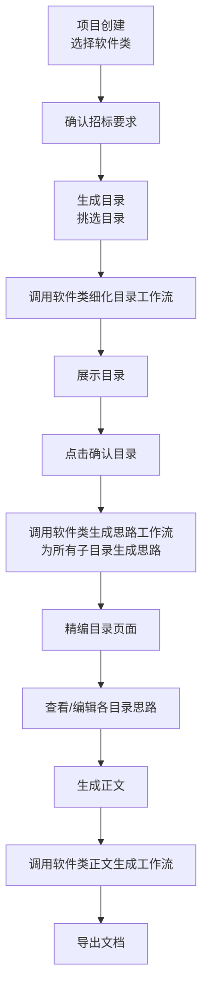
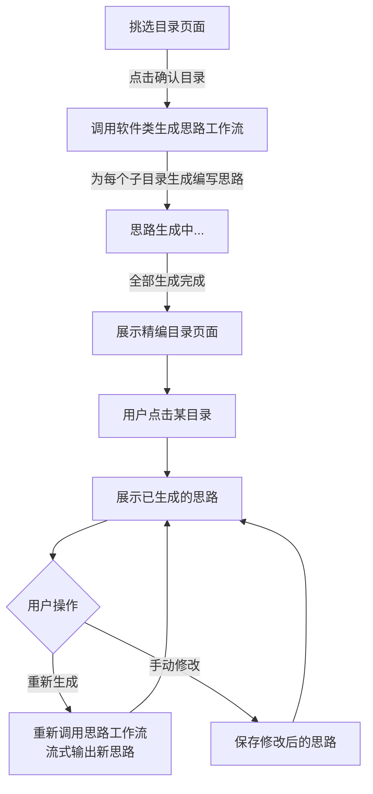

# 产品需求文档（PRD）

## 1. 文档信息

| 项目 | 内容 |
|------|------|
| **文档名称** | AI编标-软件类专项编写功能需求文档 |
| **产品名称** | 标桥·AI编标 |
| **功能名称** | 软件类专项编写 |
| **版本** | v1.0 |
| **创建日期** | 2026-04-27 |
| **创建人** | 产品经理 |

---

## 2. 变更日志

| 版本号 | 修改日期 | 修改人 | 主要变更内容 | 备注 |
|--------|----------|--------|--------------|------|
| v1.0 | 2026-04-27 | - | 初始版本 | 软件类专项编写功能 |

---

## 3. 产品/需求概述

### 3.1 需求背景

AI编标产品目前支持工程、货物、服务三大类型技术标书的快速生成。随着软件行业投标需求的增加，软件类项目（如软件开发、系统集成、信息化服务等）的投标文件编写成为新的市场痛点。

**内部需求：** 我公司也会投软件类的标，新增软件类专项编写能力，主要是为了满足公司内部软件类技术标方案编写的降本增效需求，提升软件类投标文件的编写效率和内容质量。

软件类标书与传统服务类标书存在显著差异：
- **内容侧重不同**：软件类更关注技术架构、功能模块、开发流程、项目管理方法论
- **编写思路不同**：需要突出软件设计能力、技术方案先进性、项目实施方法论

为满足软件类项目的投标需求，需要在现有服务类基础上细分出"软件类"专项，并配套软件类专属AI工作流。

### 3.2 需求价值

- **满足内部需求**：解决公司内部软件类技术标方案编写的降本增效问题
- **拓展市场覆盖**：满足软件行业用户的投标需求，扩大产品适用范围
- **提升生成质量**：通过软件类专属工作流，生成更符合软件行业特点的投标内容
- **保持用户体验**：软件类项目沿用现有操作流程，用户无感知切换成本

### 3.3 核心目标

1. 在项目创建时支持选择"软件类"项目类型
2. 软件类项目调用专属AI工作流生成目录、思路和正文
3. 确保软件类项目的操作流程与现有项目保持一致

---

## 4. 功能清单

| 序号 | 功能模块 | 功能点 | 优先级 |
|------|----------|--------|--------|
| 1 | 项目创建 | 服务类细分增加"软件类"选项 | P0 |
| 2 | 细化目录 | 软件类项目调用专属细化目录工作流 | P0 |
| 3 | 精编目录 | 软件类项目调用专属生成思路工作流 | P0 |
| 4 | 生成正文 | 软件类项目调用专属正文生成工作流 | P0 |

---

## 5. 关联模块

| 模块 | 关联说明 |
|------|----------|
| 项目创建模块 | 增加软件类类型选择 |
| 目录生成模块 | 根据项目类型调用不同工作流 |
| 思路生成模块 | 精编目录时调用思路工作流 |
| 正文生成模块 | 根据项目类型调用不同工作流 |

---

## 6. 核心业务流程

### 6.1 整体业务流程



### 6.2 生成思路流程（重点）



---

## 7. 功能详细描述

### 7.1 项目创建-类型选择

#### 功能说明
在项目创建页面，将原有的"服务类"选项进行细分，增加"软件类"子选项。用户选择软件类后，系统将在后续流程中调用软件类专属AI工作流。

#### 前置条件
- 用户已进入项目创建页面
- 已完成招标文件上传

#### 页面结构
1. **项目类型选择区**：
   - 工程类
   - 货物类
   - 服务类（可展开）
     - 服务类-通用
     - 服务类-软件类（新增）

#### 业务规则
| 规则项 | 说明 |
|--------|------|
| 类型层级 | 软件类隶属于服务类下的细分类型 |
| 存储方式 | projectType字段存储"software"标识 |
| 兼容性 | 已创建的项目类型不受影响 |

#### 交互规则
- 点击"服务类"展开子选项，显示"服务类-通用"和"服务类-软件类"
- 默认选中"服务类-通用"
- 选择"软件类"后，后续流程调用软件类专属工作流

---

### 7.2 细化目录-软件类工作流

#### 功能说明
当项目类型为软件类时，在"步骤三：生成目录-挑选目录"环节，调用软件类专属细化目录工作流生成目录结构。

#### 前置条件
- 项目类型为软件类
- 用户已完成招标要求确认，进入目录生成环节

#### 业务流程
1. 系统识别项目类型为软件类
2. 调用软件类细化目录工作流（swf_doc_gen_stoc_v2_test）
3. 通过流式输出获取生成的目录结构
4. 解析并展示目录到页面

#### 业务规则
| 规则项 | 说明 |
|--------|------|
| 工作流切换 | 仅软件类项目调用此工作流，其他类型沿用原工作流 |
| 入参兼容 | 原有入参保持不变，新增projectType字段传递"software" |
| 出参格式 | 与原细化目录工作流出参格式一致 |

---

### 7.3 精编目录-生成思路工作流

#### 功能说明
用户在挑选目录页面点击"确认目录"按钮后，系统在后台调用软件类专属生成思路工作流，为所有子目录生成编写思路。思路生成完成后，才展示精编目录页面。用户在精编目录页面点击某条目录时，即可看到已生成的思路，并支持重新生成或手动修改。

#### 前置条件
- 项目类型为软件类
- 用户在挑选目录页面已确认目录，点击"确认目录"按钮

#### 业务流程
1. 用户在挑选目录页面点击"确认目录"按钮
2. 系统调用软件类生成思路工作流（sfw_cnt_gen_idea_v1_test）
3. 为所有子目录批量生成编写思路（流式输出）
4. 全部生成完成后，展示精编目录页面
5. 用户点击某条目录，展示已生成的思路
6. 用户可点击"重新生成"或手动编辑思路

#### 页面结构
1. **思路生成加载页**（新增）：
   - 展示生成进度（如"正在为第X/Y个目录生成思路..."）
   - 流式展示当前生成的思路内容
2. **精编目录页面**：
   - 目录树区域
   - 子目录编辑区（正文要求文本框展示已生成的思路）
   - "重新生成"按钮

#### 业务规则
| 规则项 | 说明 |
|--------|------|
| 生成时机 | 点击"确认目录"后批量生成，非进入精编目录后逐个生成 |
| 展示方式 | 精编目录页面直接展示已生成的思路 |
| 重新生成 | 支持针对单个子目录重新调用工作流生成 |
| 手动编辑 | 支持手动修改思路内容并保存 |

#### 交互规则
| 操作 | 触发条件 | 交互反馈 |
|------|----------|----------|
| 确认目录 | 点击"确认目录"按钮 | 进入思路生成加载页，显示生成进度 |
| 查看思路 | 在精编目录点击某目录项 | 右侧文本框展示已生成的思路 |
| 重新生成 | 点击"重新生成"按钮 | 按钮置灰，文本框清空后重新流式输出新思路 |
| 手动编辑 | 用户在文本框输入 | 实时保存编辑内容，提示"已保存" |

#### 异常处理
| 异常场景 | 处理方式 |
|----------|----------|
| 批量生成失败 | 提示"思路生成失败，点击重试"，返回挑选目录页面或提供"重新生成"按钮 |
| 单个子目录重新生成失败 | 保留原有思路内容，提示"重新生成失败，已保留原内容" |

---

### 7.4 生成正文-软件类工作流

#### 功能说明
在生成正文页面，软件类项目调用专属正文生成工作流，生成各章节正文内容。

#### 前置条件
- 项目类型为软件类
- 用户已完成目录精编，进入正文生成页面

#### 业务流程
1. 用户点击"一键生成"或"生成章节"
2. 系统识别项目类型为软件类
3. 调用软件类正文生成工作流（sfw_write_sec_async_test）
4. 获取生成的正文内容并展示

#### 业务规则
| 规则项 | 说明 |
|--------|------|
| 工作流统一 | 软件类项目只使用一个工作流，不区分同步/异步 |
| 入参兼容 | 原有入参保持不变，新增projectType字段传递"software" |
| 字数统计 | 使用出参中的zishu字段统计生成字数 |
| 计费规则 | 按实际生成的字数计费，与现有规则一致 |

---

### 7.5 附表生成说明

软件类项目属于服务类，沿用服务类的附表生成逻辑（不展示工程类附表入口）。

---

## 8. 工作流对接

### 8.1 工作流 1：软件类细化目录

| 项目 | 内容 |
|------|------|
| **名称** | swf_doc_gen_stoc_v2_test |
| **ID** | 7633244332162039871 |
| **工作流地址** | https://www.coze.cn/work_flow?workflow_id=7633244332162039871&space_id=7516809531788427327 |
| **调用时机** | 软件类项目生成目录时 |
| **输出方式** | 流式输出 |

**入参：**

| 字段名称 | 数据类型 | 必填 | 说明 |
|----------|----------|------|------|
| all_yiJiMuLu | string | 是 | 所有一级目录的JSON字符串 |
| bidrequirement | string | 是 | 招标要求内容 |
| generate_method | string | 是 | 目录生成方式 |
| pfbz | string | 是 | 评分标准 |
| project_type | string | 是 | 项目类型（展示用） |
| provided_mulu | string | 是 | 招标文件提供的目录 |
| qdcontent | string | 是 | 清单内容 |
| yiJiMuLu | array | 是 | 一级目录数组，元素包含chaptername、chaptertype、chapterid、pagesize |
| zishu_PerPage | int | 是 | 每页字数 |
| projectType | string | 是 | 【新增】项目类型标识，固定传"software" |

**出参：**

| 字段名称 | 数据类型 | 说明 |
|----------|----------|------|
| 流式输出 | - | 返回细化的目录结构内容 |

---

### 8.2 工作流 2：软件类生成思路

| 项目 | 内容 |
|------|------|
| **名称** | sfw_cnt_gen_idea_v1_test |
| **ID** | 7631882167584505883 |
| **工作流地址** | https://www.coze.cn/work_flow?workflow_id=7631882167584505883&space_id=7516809531788427327 |
| **调用时机** | 挑选目录点击确认目录后，批量为所有子目录生成思路 |
| **输出方式** | 流式输出 |

**入参：**

| 字段名称 | 数据类型 | 必填 | 说明 |
|----------|----------|------|------|
| bid_requirement | string | 是 | 招标要求 |
| fuMuLu_1 | string | 是 | 一级父目录名称 |
| fuMuLu_2 | string | 否 | 二级父目录名称 |
| fuMuLu_3 | string | 否 | 三级父目录名称 |
| projectType | string | 是 | 【新增】项目类型标识，固定传"software" |
| qingdan_content | string | 是 | 清单内容 |
| ziMuLu | string | 是 | 当前子目录名称 |

**出参：**

| 字段名称 | 数据类型 | 说明 |
|----------|----------|------|
| output_idea | string | 生成的编写思路内容 |

---

### 8.3 工作流 3：软件类生成正文

| 项目 | 内容 |
|------|------|
| **名称** | sfw_write_sec_async_test |
| **ID** | 7631876228513644590 |
| **工作流地址** | https://www.coze.cn/work_flow?workflow_id=7631876228513644590&space_id=7516809531788427327 |
| **调用时机** | 生成正文时 |
| **输出方式** | 异步调用 |

**入参：**

| 字段名称 | 数据类型 | 必填 | 说明 |
|----------|----------|------|------|
| biaoTi_cengJi | int | 是 | 标题层级 |
| biaoge | bool | 是 | 是否生成表格 |
| bid_requirement | string | 是 | 招标要求 |
| expect_word_count | int | 是 | 期望字数 |
| fuMuLu_1 | string | 是 | 一级父目录 |
| fuMuLu_2 | string | 否 | 二级父目录 |
| fuMuLu_3 | string | 否 | 三级父目录 |
| ideas | string | 是 | 编写思路 |
| knowledge | array | 是 | 素材知识，元素包含tags、content、materialguid、attachguid_kb |
| outline | string | 是 | 目录大纲 |
| picture | bool | 是 | 是否配图 |
| projectType | string | 是 | 【新增】项目类型标识，固定传"software" |
| qingdan_content | string | 是 | 清单内容 |
| zhuyu | string | 是 | 正文主语（如"我单位"、"我司"） |

**出参：**

| 字段名称 | 数据类型 | 说明 |
|----------|----------|------|
| zishu | int | 生成内容的字数 |
| content | string | 生成的正文内容 |

---

## 9. 验收标准

| 验收模块 | 验收项 | 验收标准 | 验证方式 |
|----------|--------|----------|----------|
| 项目创建 | 类型选择 | 服务类下展示"软件类"选项，可正常选中 | 手工测试 |
| 项目创建 | 类型存储 | 创建软件类项目后，数据库正确存储projectType为"software" | 查库验证 |
| 细化目录 | 工作流调用 | 软件类项目调用swf_doc_gen_stoc_v2_test工作流 | 日志验证 |
| 细化目录 | 目录生成 | 软件类项目可正常生成目录，展示到页面 | 手工测试 |
| 生成思路 | 批量生成时机 | 点击确认目录后、进入精编目录前调用思路工作流 | 日志验证 |
| 生成思路 | 进度展示 | 思路生成过程中展示生成进度页面 | 手工测试 |
| 生成思路 | 思路展示 | 精编目录页面直接展示已生成的思路内容 | 手工测试 |
| 生成思路 | 重新生成 | 支持针对单个子目录重新调用工作流生成思路 | 手工测试 |
| 生成思路 | 手动编辑 | 支持手动修改思路内容并保存 | 手工测试 |
| 生成正文 | 工作流调用 | 软件类项目调用sfw_write_sec_async_test工作流 | 日志验证 |
| 生成正文 | 内容生成 | 软件类项目可正常生成正文内容 | 手工测试 |
| 兼容性 | 历史项目 | 已创建的非软件类项目正常工作 | 回归测试 |

---

## 10. 附录

### 10.1 工作流参数示例

**软件类细化目录入参示例：**
```json
{
  "all_yiJiMuLu": "[{\"chaptername\":\"项目概述\",\"chaptertype\":\"1\",\"chapterid\":\"1\",\"pagesize\":5}]",
  "bidrequirement": "项目概况：开发一套智慧城市管理系统...",
  "generate_method": "融合",
  "pfbz": "技术方案完整性30分...",
  "project_type": "软件类",
  "provided_mulu": "一、项目概述 二、技术方案...",
  "qdcontent": "功能清单：1.用户管理模块...",
  "yiJiMuLu": [
    {"chaptername": "项目概述", "chaptertype": "1", "chapterid": "1", "pagesize": 5}
  ],
  "zishu_PerPage": 800,
  "projectType": "software"
}
```

**软件类生成思路入参示例：**
```json
{
  "bid_requirement": "项目概况：开发一套智慧城市管理系统...",
  "fuMuLu_1": "技术方案",
  "fuMuLu_2": "系统架构设计",
  "fuMuLu_3": "",
  "projectType": "software",
  "qingdan_content": "功能清单：1.用户管理模块...",
  "ziMuLu": "总体架构设计"
}
```

**软件类生成正文入参示例：**
```json
{
  "biaoTi_cengJi": 3,
  "biaoge": true,
  "bid_requirement": "项目概况：开发一套智慧城市管理系统...",
  "expect_word_count": 1500,
  "fuMuLu_1": "技术方案",
  "fuMuLu_2": "系统架构设计",
  "fuMuLu_3": "",
  "ideas": "本节需要阐述系统的整体架构设计思路...",
  "knowledge": [
    {"tags": "技术方案", "content": "公司技术积累...", "materialguid": "xxx", "attachguid_kb": "xxx"}
  ],
  "outline": "技术方案 - 系统架构设计 - 总体架构设计",
  "picture": true,
  "projectType": "software",
  "qingdan_content": "功能清单：1.用户管理模块...",
  "zhuyu": "我单位"
}
```

---

**文档结束**
